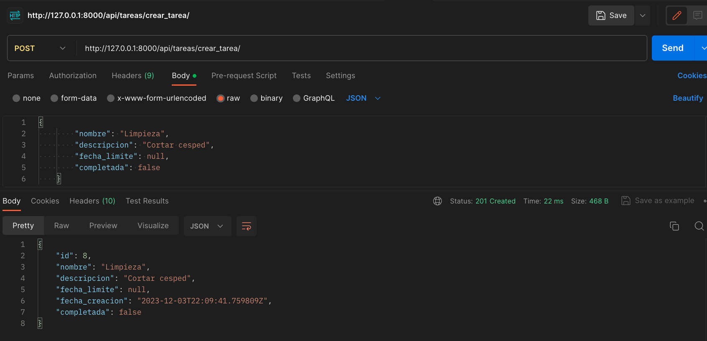
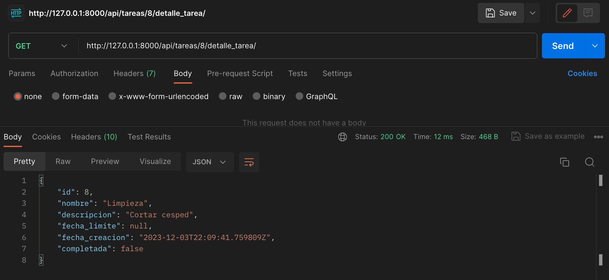
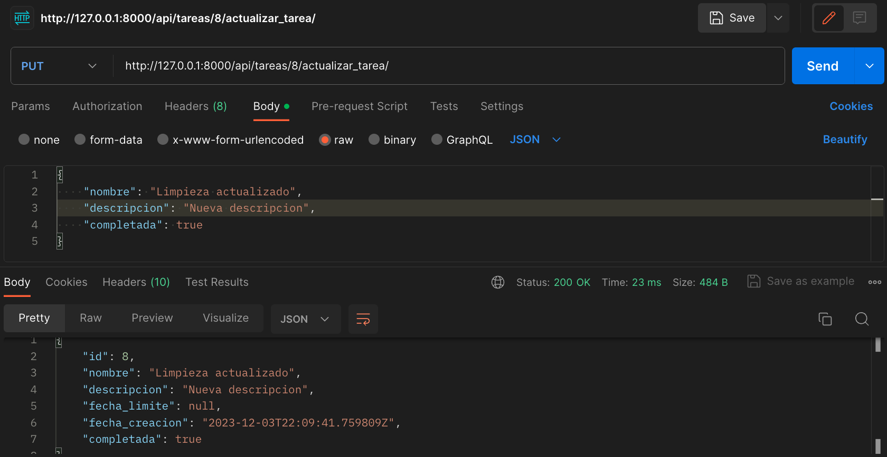
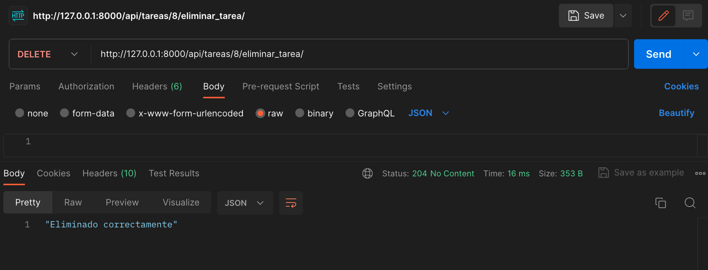

# Django Rest Framework First Project

Conocemos mas a detalle las herramientas que ofrece DRF sobre Django
## Creacion de un entorno virtual

 - [Guia Windows](https://micro.recursospython.com/recursos/como-crear-un-entorno-virtual-venv.html)

    1. Abre el CMD y ubícate en la carpeta en donde quieres crear el entorno virtual
    2. Ejecuta ```python -m venv mi_entorno```
    3. Ejecuta ```mi_entorno\Scripts\activate```
    


PD:
    Por cierto, es una buena práctica usar venv o env como los nombres del entorno virtual.
    Puedes activar el entorno virtual también haciendo ```mi_entorno\Scripts\activate.bat```, es exactamente lo mismo.
## Instalacion de librerias
Instala todas las librerias dentro de `requirements.txt`

```python
pip install -r requirements.txt
```

## Corre el proyecto en local

```
cd django_example
python manage.py runserver
```


# Guia de desarrollo CRUD en `views.py`

```python
from django.shortcuts import render
from rest_framework import viewsets
from rest.models import Tarea
from rest.serializers import TareaSerializer
from rest_framework.decorators import action
from rest_framework.response import Response

# Create your views here.
class TareaViewSet(viewsets.ModelViewSet):
    queryset = Tarea.objects.all()
    serializer_class = TareaSerializer
    lookup_field = 'id'

    @action(detail=False, methods=['GET'])
    def completadas(self, request):
        tareas_completadas = Tarea.objects.filter(completada=True)
        serializer = self.get_serializer(tareas_completadas, many=True)
        return Response(serializer.data)

    @action(detail=False, methods=['POST'])
    def crear_tarea(self, request):
        tarea_nueva = self.get_serializer(data=request.data)

        if tarea_nueva.is_valid():
            tarea_nueva.save()
            return Response(tarea_nueva.data, status=201)
        else:
            return Response(tarea_nueva.data, status=404)
        
    @action(detail=True, methods=['GET'])
    def detalle_tarea(self, request, id=None):
        tarea = self.get_object()
        serializer = self.get_serializer(tarea)
        return Response(serializer.data)

    @action(detail=True, methods=['PUT', 'PATCH'])
    def actualizar_tarea(self, request, id=None):
        tarea = self.get_object()
        serializer = self.get_serializer(tarea, data=request.data, partial=True)

        if serializer.is_valid():
            serializer.save()
            return Response(serializer.data)
        else:
            return Response(serializer.errors, status=400)

    @action(detail=True, methods=['DELETE'])
    def eliminar_tarea(self, request, id=None):
        tarea = self.get_object()
        tarea.delete()
        return Response("Eliminado correctamente", status=204)
    
```


# TareaViewSet

`TareaViewSet` es una vista en Django Rest Framework (DRF) que proporciona operaciones CRUD (Crear, Leer, Actualizar, Eliminar) para el modelo `Tarea`.

## Listar todas las tareas

- **Método:** `GET`
- **URL:** `/api/tareas/`
- **Descripción:** Retorna la lista completa de todas las tareas.

### Crear una nueva tarea (acción personalizada)

- **Método:** `POST`
- **URL:** `/api/tareas/crear_tarea/`
- **Descripción:** Crea una nueva tarea utilizando los datos proporcionados en la solicitud.

    **Explicación del código:**
    - `@action(detail=False, methods=['POST'])`: Utiliza el decorador `@action` para definir una acción personalizada que responde a solicitudes POST. La opción `detail=False` indica que esta acción no requiere un identificador específico en la URL.
    - `tarea_nueva = self.get_serializer(data=request.data)`: Se utiliza el serializador para validar y deserializar los datos de la solicitud.
    - `if tarea_nueva.is_valid():`: Verifica si los datos de la tarea son válidos.
    - `tarea_nueva.save()`: Guarda la nueva tarea en la base de datos.
    - `return Response(tarea_nueva.data, status=201)`: Retorna los datos de la tarea creada con un código de estado 201 (creado). Si los datos no son válidos, se retorna un código de estado 400.
    - `else:`: Si los datos no son válidos, se ejecuta este bloque.
    - `return Response(tarea_nueva.data, status=404)`: Retorna los datos de la tarea con un código de estado 404 (no encontrado) para indicar un error en la solicitud.


    

### Obtener detalles de una tarea específica

- **Método:** `GET`
- **URL:** `/api/tareas/{id}/detalle_tarea/`
- **Descripción:** Retorna los detalles de la tarea con el identificador especificado.

    **Explicación del código:**
    - `tarea = self.get_object()`: Obtiene la tarea específica utilizando el identificador proporcionado en la URL.
    - `serializer = self.get_serializer(tarea)`: Utiliza el serializador para convertir la tarea en formato JSON.
    - `return Response(serializer.data)`: Retorna los detalles de la tarea.

    

### Actualizar una tarea existente

- **Método:** `PUT` o `PATCH`
- **URL:** `/api/tareas/{id}/actualizar_tarea/`
- **Descripción:** Actualiza una tarea existente con los datos proporcionados en la solicitud.

    **Explicación del código:**
    - `tarea = self.get_object()`: Obtiene la tarea específica utilizando el identificador proporcionado en la URL.
    - `serializer = self.get_serializer(tarea, data=request.data, partial=True)`: Utiliza el serializador para validar y actualizar los datos de la tarea, permitiendo actualizaciones parciales (PATCH).
    - `if serializer.is_valid():`: Verifica si los datos de la tarea son válidos.
    - `serializer.save()`: Guarda los cambios en la tarea.
    - `return Response(serializer.data)`: Retorna los datos actualizados de la tarea.

    

### Eliminar una tarea

- **Método:** `DELETE`
- **URL:** `/api/tareas/{id}/eliminar_tarea/`
- **Descripción:** Elimina la tarea con el identificador especificado.

    **Explicación del código:**
    - `tarea = self.get_object()`: Obtiene la tarea específica utilizando el identificador proporcionado en la URL.
    - `tarea.delete()`: Elimina la tarea de la base de datos.
    - `return Response("Eliminado correctamente", status=204)`: Retorna un código de estado 204 (con un mensaje) para indicar una eliminación exitosa.

    
